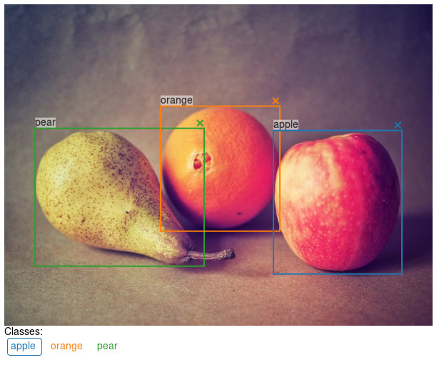

# jupyter\_bbox\_widget

A Jupyter widget for annotating images with bounding boxes.


```python
from jupyter_bbox_widget import BBoxWidget
widget = BBoxWidget(
    image='fruit.jpg',
    classes=['apple', 'orange', 'pear'],
)
widget
```



Create, edit, move, resize and delete bounding box annotations using the mouse.

Use `widget.bboxes` to get current annotations values:

```python
widget.bboxes
# [{'x': 377, 'y': 177, 'width': 181, 'height': 201, 'label': 'apple'},
#  {'x': 219, 'y': 142, 'width': 169, 'height': 171, 'label': 'orange'},
#  {'x': 43,  'y': 174, 'width': 234, 'height': 195, 'label': 'pear'}]
```

You can also assign to `widget.bboxes` to display any annotations. For example, use the output of an object detection model to do model-assisted labeling.

```python
widget.bboxes = [
    {'x': 377, 'y': 177, 'width': 181, 'height': 201, 'label': 'apple'},
    {'x': 219, 'y': 142, 'width': 169, 'height': 171, 'label': 'orange'},
    {'x': 43,  'y': 174, 'width': 234, 'height': 195, 'label': 'pear'}
]
```

*Fruit photo by <a href="https://unsplash.com/@umanoide?utm_source=unsplash&utm_medium=referral&utm_content=creditCopyText">Umanoide</a> on <a href="https://unsplash.com/?utm_source=unsplash&utm_medium=referral&utm_content=creditCopyText">Unsplash</a>*
  
## Installation

You can install using `pip`:

```bash
pip install jupyter_bbox_widget
```

Or if you use jupyterlab:

```bash
pip install jupyter_bbox_widget
jupyter labextension install @jupyter-widgets/jupyterlab-manager
```

If you are using Jupyter Notebook 5.2 or earlier, you may also need to enable
the nbextension:

```bash
jupyter nbextension enable --py [--sys-prefix|--user|--system] jupyter_bbox_widget
```

## Usage

Creating and editing annotations is done with the mouse:

- click and drag to create a bbox
- click and drag corners or edges to resize a bbox
- click and drag inside a bbox to move it
- in order to change a label select a new label below the image and click on label text

The notebook in [`examples/introduction.ipynb`](examples/introduction.ipynb) has an example of how to use this widget together with `ipywidgets` to create a simple annotation workflow.

## Known Issues

Sometimes after rerunning a cell that outputs the widget you can see the image but no annotations and clicks don't create new bboxes. If this happens then you need to resize browser window so that image width changes. Then the widget should work again. I'm working on making this unnecessary.

If you observe changes to bboxes with `widget.observe(my_function, names=['bboxes'])` then be aware that sometimes a dummy bbox may appear in the list. It looks like `{'x':0, 'y':0, 'width':0, 'height':0, 'label':''}`. The reason for this is that changes from moving or resizing bboxes don't get transfered from js to python. Only when the length of `bboxes` list changes does python get notified about this. So as a workaround I add and remove a dummy bbox to sync other edits. Hopefully I'll find a better way around this issue.

## Development Installation

This project was inspired by a blogpost [Creating Reactive Jupyter Widgets With Svelte](https://cabreraalex.medium.com/creating-reactive-jupyter-widgets-with-svelte-ef2fb580c05) and was created based on [widget-svelte-cookiecutter](https://github.com/cabreraalex/widget-svelte-cookiecutter) template.

```bash
# First install the python package. This will also build the JS packages.
pip install -e .
```

When developing your extensions, you need to manually enable your extensions with the
notebook / lab frontend. For lab, this is done by the command:

```
jupyter labextension install @jupyter-widgets/jupyterlab-manager --no-build
jupyter labextension install .
```

For classic notebook, you can run:

```
jupyter nbextension install --sys-prefix --symlink --overwrite --py jupyter_bbox_widget
jupyter nbextension enable --sys-prefix --py jupyter_bbox_widget
```

Note that the `--symlink` flag doesn't work on Windows, so you will here have to run
the `install` command every time that you rebuild your extension. For certain installations
you might also need another flag instead of `--sys-prefix`, but we won't cover the meaning
of those flags here.

### How to see your changes

#### Typescript:

To continuously monitor the project for changes and automatically trigger a rebuild, start Jupyter in watch mode:

```bash
jupyter lab --watch
```

And in a separate session, begin watching the source directory for changes:

```bash
npm run watch
```

After a change wait for the build to finish and then refresh your browser and the changes should take effect.

#### Python:

If you make a change to the python code then you will need to restart the notebook kernel to have it take effect.
