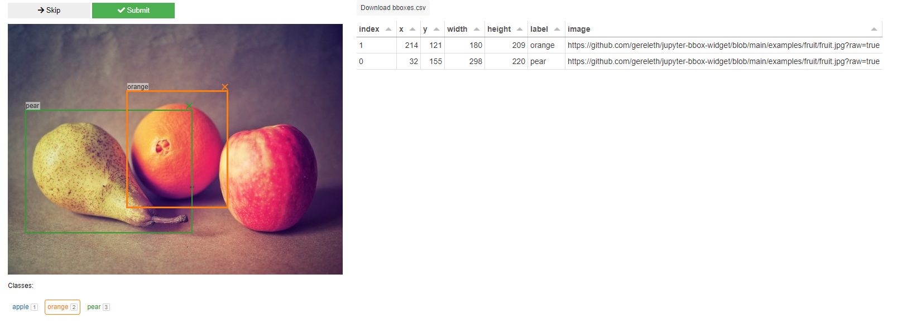

# Using `jupyter-bbox-widget` with Panel

Leverage the `jupyter_bbox_widget` in combination with [Panel](https://panel.holoviz.org/reference/index.html) to build interactive notebook tools and data-driven applications.

## Installation

To get started, install the required packages by running:

```bash
pip install panel jupyter-bbox-widget watchfiles ipywidgets-bokeh
```

## Usage

Create a file named **app.py** and add the following code:

```python
import panel as pn
from jupyter_bbox_widget import BBoxWidget

pn.extension("ipywidgets")

widget = BBoxWidget(
    image="https://github.com/gereleth/jupyter-bbox-widget/blob/main/examples/fruit/fruit.jpg?raw=true",
    classes=['apple', 'orange', 'pear'],
)

pn.panel(widget).servable()
```

To serve the app, execute:

```bash
panel serve app.py
```

Open [http://localhost:5006/](http://localhost:5006/) in your browser to view the application, which should look like this:


## Examples

### Tool

The **[tool.py](tool.py)** example demonstrates how to support multi-image annotations, display results in a table, and download annotations as a CSV file.



## Support

For questions or support related to [Panel](https://panel.holoviz.org/reference/index.html), visit the [HoloViz Discourse Forum](https://discourse.holoviz.org/).
